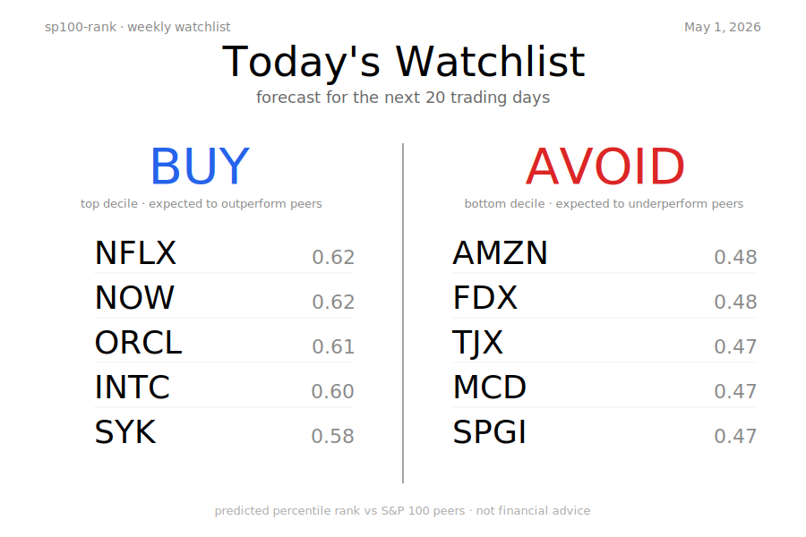
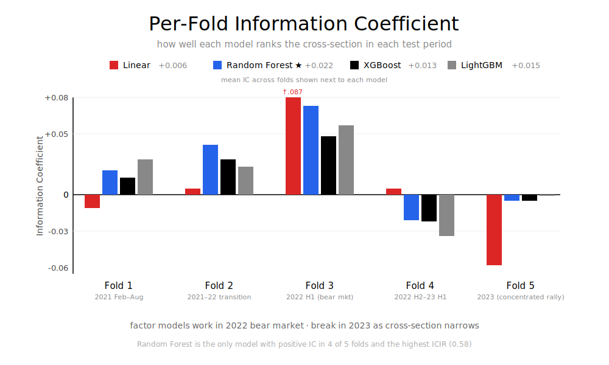
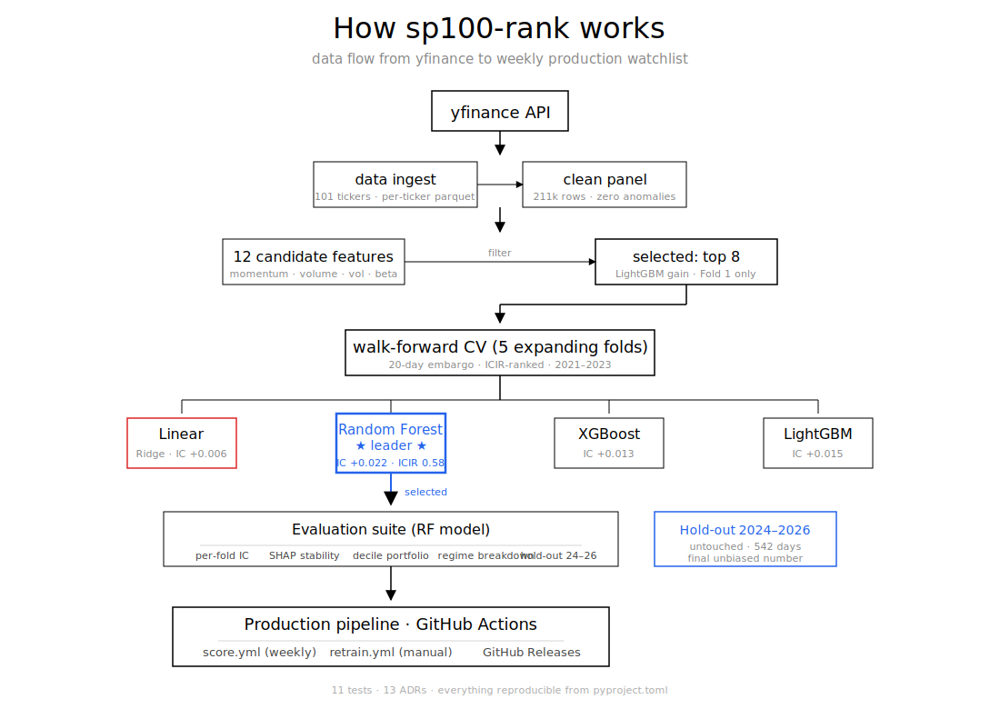
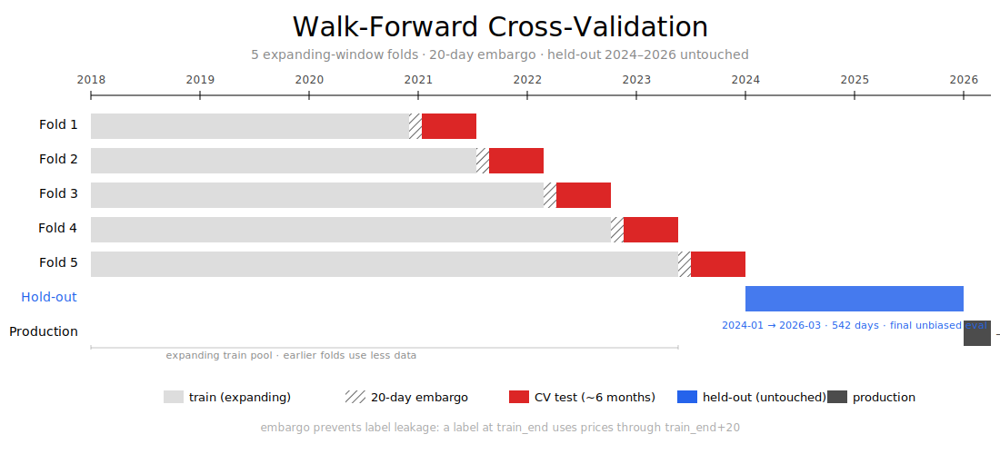

# sp100-rank

Cross-sectional return ranking for 100 large-cap U.S. equities. — by [Malith J. Don](https://www.linkedin.com/in/malithjayad/), 2026.



The system trains gradient-boosted models on technical features, evaluates them via walk-forward cross-validation across 5 folds, and exposes the lead model behind an automated GitHub Actions pipeline that retrains on demand and scores the universe weekly.

---

## Headline result

Walk-forward CV across 5 folds, Feb 2021 – Nov 2023:



| Model        | Mean IC | ICIR  | Best fold | Worst fold |
|--------------|---------|-------|-----------|------------|
| Linear       | +0.006  | 0.11  | +0.087    | -0.058     |
| **Random Forest** | **+0.022**  | **0.58**  | +0.073    | -0.021     |
| XGBoost      | +0.013  | 0.46  | +0.048    | -0.022     |
| LightGBM     | +0.015  | 0.43  | +0.057    | -0.034     |

Tree models substantially outperform the linear baseline. Random Forest leads on ICIR — both the highest mean IC and the most stable across folds.

A mean IC of 0.022 is modest in absolute terms — real-world ICs from professional stock selection models are [generally small in magnitude and volatile across time](https://arxiv.org/abs/2010.08601). Grinold (referenced in [MSCI Barra's IC documentation](https://app2.msci.com/products/analytics/aegis/PI_Converting_Scores_Into_Alphas.pdf)) characterizes IC = 0.05 as "good" and IC = 0.10 as "very good," but realized ICs in practice are often smaller. For comparison, [top-quartile equity managers achieve annualized information ratios of around 0.5](https://en.wikipedia.org/wiki/Information_ratio); our cross-sectional ICIR of 0.58 (annualized 2.05 via Grinold's fundamental law) is a *prediction signal* metric, not a portfolio implementation metric — the decile portfolio simulation below gives the realistic Sharpe.

---

## Hold-out evaluation (year-by-year)

The hold-out set 2024-01-01 → 2026-03-31 was never touched during walk-forward CV, hyperparameter tuning, or feature selection. The Random Forest model was trained on all data through end-of-2023 and evaluated on this hold-out:

| Period       | Days | Mean IC  | What was happening |
|--------------|------|----------|--------------------|
| 2024 full    | 252  | **-0.021** | Post-AI-rally factor decay; concentrated mega-cap returns |
| 2025 full    | 250  | **+0.017** | Factor signals partially recovering |
| 2026 Q1      | 40   | **+0.136** | Strong recovery (small sample, ±0.05 std error) |
| **Combined** | **542** | **+0.008** | t-stat 1.24 (p ≈ 0.21) |

The combined hold-out cannot statistically reject H0: alpha = 0. This is the unbiased final estimate. The 2024 negative IC is the project's most important finding — it demonstrates the regime-transfer cost of training on 2018–2023 data, exactly the kind of effect that walk-forward CV alone underestimates. The 2025–2026 recovery is consistent with the AI-rally distortion of 2023–2024 unwinding as the cross-section re-broadened.

This honest hold-out result is more informative than the in-sample walk-forward IC. Methodology mature enough to surface the regime-transfer problem instead of glossing it.

---

## What this project does



Predicts which of 100 large-cap US stocks will outperform their peers over the next 20 trading days. The model produces a percentile rank per stock per date — values in [0, 1] where 0.95 means "expected to be in the top 5% of performers." A weekly watchlist tags the top 20% as BUY, bottom 20% as AVOID, middle 60% as HOLD.

The model isn't designed to predict market direction. It's designed to *rank* — to tell you which stocks to favor *relative to each other*, regardless of whether the market is going up or down.

---

## Data span and how it's used

8 years 4 months of OHLCV data, partitioned as:

```
2018-01-02 ──────────────────────────────────────────────── 2026-04
   │                                                              │
   ├── Walk-forward training pool ──────┐                         │
   │   (data each fold can train on)    │                         │
   │                                    │                         │
   ├──── Fold 1 train ────────────┐ embargo ┌── Fold 1 test ──┐  │
   │                              │  20d    │ 2021-02→2021-08 │  │
   │                              └─────────┴─────────────────┘  │
   │                                                              │
   ├──── Fold 2 train ────────────────┐ embargo ┌── Fold 2 test ──┐
   │                                  │  20d    │ 2021-08→2022-03 │
   │                                  └─────────┴─────────────────┘
   │                                                              │
   ├──── Fold 3, 4, 5 (continuing pattern, expanding) ────────────┤
   │                              ... last test ends 2023-11      │
   │                                                              │
   ├──── HOLD-OUT (untouched) ───────────────────────────────────►│
   │     2024-01-01 → 2026-03-31                                  │
   │     Used ONCE for unbiased final evaluation.                 │
   │                                                              │
   └──── PRODUCTION (live) ──────────────────────────────────────►
         2026-04 onwards: weekly scoring CSVs in outputs/scores/
         Quarterly retrains pull this period into training data.
```

The walk-forward CV gives 5 independent (train, test) pairs to evaluate model selection. The hold-out gives one final unbiased number that no decision touched. Production scoring uses the most recently retrained model checkpoint.

---

## What's actually interesting about it

The proposal made three claims that the implementation actually backs up.

**Walk-forward CV with proper embargo.** Five expanding-window folds, 20-day gap between train_end and test_start to prevent label leakage. Test period spans Feb 2021 – Nov 2023 across regime transitions (recovery, bear, recovery). 2024–2026 reserved as held-out sample never touched during model selection.

**Regime-aware evaluation.** Per-fold IC stratified by year, by trend regime (SPX vs 200-day MA), and by volatility regime (rolling 60-day realized vol vs expanding median). The four trend × vol cells reveal that RF is the only model with positive IC in all four — which is the case for picking it over models with higher tail Sharpe but worse stability.

**Automated production pipeline.** Two GitHub Actions workflows:
- **score.yml** runs every Monday morning, refreshes data, fetches the latest model checkpoint from a GitHub Release, scores all 100 stocks, and commits the ranked watchlist back to the repo.
- **retrain.yml** runs on manual trigger (or quarterly cron when enabled), retrains the lead model on all data through today, and publishes the new checkpoint as a versioned Release asset.

The separation between scoring and retraining is the key engineering choice — scoring is cheap and frequent; retraining is expensive and infrequent. Most academic ML pipelines blur the two.

---

## Decile portfolio simulation

The IC measures *prediction quality*; the decile portfolio simulates *what trading on those predictions would actually have returned*. Long top decile, short bottom decile, 20-day non-overlapping rebalance, with transaction-cost sensitivity:

| Model    | Sharpe (0 bps) | Sharpe (5 bps) | Sharpe (10 bps) |
|----------|----------------|----------------|-----------------|
| Linear   | 0.92           | 0.86           | 0.79            |
| LightGBM | 0.72           | 0.63           | 0.54            |
| RF       | 0.52           | 0.43           | 0.35            |
| XGBoost  | 0.48           | 0.39           | 0.30            |

A subtle finding: IC and Sharpe rankings disagree. Linear has the worst IC but the best Sharpe. Why? IC measures how well the *full cross-section* is ranked; Sharpe measures only how the *tails* (top vs bottom decile) perform. Linear's predictions cluster in the middle but separate the tails cleanly. RF's predictions are better-ranked overall but compress the tails through tree averaging.

For a real fund, Sharpe matters more. For a research signal that feeds into a multi-strategy framework, IC matters more. Both metrics are reported.

---

## Methodology highlights



Detail lives in [`docs/decisions.md`](docs/decisions.md), which logs every non-trivial design decision as a dated ADR. Headlines:

- **Universe**: 100 hand-curated large-cap US equities + ^GSPC market proxy. Survivorship bias is documented, not denied.
- **Features**: 12 candidates (momentum, oscillators, volume, position-relative, beta, drawdown). Filtered to top 8 via LightGBM gain importance on Fold 1 train data only — selection on later folds would leak future information into model decisions.
- **Label**: cross-sectional percentile rank of 20-day forward return. Realistic execution alignment: features at date *t* use OHLCV through close of *t*; trade fills at close of *t+1*; position closes at close of *t+21*. The 1-day lag prevents same-bar leakage.
- **Models**: Ridge (linear baseline), Random Forest, XGBoost, LightGBM. Identical feature set across all four.
- **Hyperparameter tuning**: small grid (~4–8 combinations per model), Fold 1 inner train/val split with embargo, ranked by ICIR not raw mean IC.
- **No-lookahead test**: every feature must produce identical values when future prices are corrupted. Catches an entire class of subtle bugs in 0.5 seconds.
- **SHAP stability across folds**: per-fold TreeSHAP for the RF model. Reveals that liquidity and beta features (`log_dollar_vol_60`, `beta_to_spx_60`) are stable across regimes; momentum features (`mom_12_1`, `pct_52w_high`) are regime-dependent.
- **Cross-sectional standardization** was tested and rejected — tree models lost ~80% of their IC with rank-normalized features. Documented as ADR-012; an example of empirical testing overriding textbook recommendation.

---

## Repository structure

```
src/sp100rank/
  data/         # ingest (yfinance), clean, universe definition
  features/     # 12 technical features, cross-sectional rank label, feature selection
  models/       # 4-model registry, hyperparameter tuner, walk-forward trainer
  eval/         # walk-forward fold generator, IC metrics, regime tagging, portfolio sim
  interpret/    # SHAP stability across folds
  pipeline/     # score.py + retrain.py — production entry points

tests/          # 11 tests: no-lookahead, label alignment, fold boundaries, label range/uniformity
docs/decisions.md          # 13 ADRs documenting every design choice
.github/workflows/         # score.yml (weekly), retrain.yml (manual/quarterly)

data/processed/   # Feature/model selection artifacts (committed):
                  #   selected_features.json — chosen 8 features + ranking
                  #   tuned_hyperparameters.json — chosen hyperparameters
                  #   fold_ic_summary.csv — per-fold IC table
                  #   shap_stability_rf.csv — feature importance per fold
                  #   portfolio_diagnostics.csv — Sharpe by model + cost
                  #   holdout_ic_rf.csv — hold-out evaluation result

outputs/scores/   # Production scoring CSVs (committed by score.yml)
```

The actual data files (`data/raw/*.parquet`, ~50 MB) and model pickles (`models/checkpoints/*.pkl`) are gitignored — too big and easily regenerable.

---

## Reproducing the results

```bash
git clone https://github.com/malithjd/sp100-rank.git
cd sp100-rank
uv sync                          # installs Python 3.12 + all deps

# Build data and features
uv run python -m sp100rank.data.ingest    # ~3 min, downloads OHLCV
uv run python -m sp100rank.data.clean     # ~10 sec, cleans + caches

# Run tests
uv run pytest tests/ -v                   # 11 tests should pass

# Train RF on all data through today
uv run python -m sp100rank.pipeline.retrain
```

The exact IC numbers depend on yfinance's data state at the time you run; for the snapshot used in the report, see `FROZEN_DATA_END = "2026-03-31"` in `src/sp100rank/config.py`.

---

## The production pipeline

Two automated workflows in `.github/workflows/`:

**`score.yml`** — Every Monday at 14:00 UTC:
1. Refreshes data from yfinance through today.
2. Fetches the latest model checkpoint from a GitHub Release.
3. Computes features, generates predictions for the latest date.
4. Writes a ranked watchlist to `outputs/scores/scores_<date>.csv`.
5. Commits the file back to main.

**`retrain.yml`** — Manual trigger (or quarterly cron when enabled):
1. Refreshes data, retrains RF on everything through today.
2. Saves a timestamped pickle to `models/checkpoints/rf/`.
3. Publishes the checkpoint as a versioned [GitHub Release](https://github.com/malithjd/sp100-rank/releases).

Latest production output: see [`outputs/scores/`](outputs/scores/) for recent watchlists and [Releases](https://github.com/malithjd/sp100-rank/releases) for model history.

---

## Honest limitations

- **Survivorship bias**: the 100-stock universe is hand-curated to names that exist today. Companies that were S&P 100 members during 2018–2026 but were removed (mergers, declines) aren't represented. Likely inflates IC by 0.005–0.015 vs a point-in-time membership panel. Documented in ADR-005.
- **Regime coverage**: walk-forward test folds span Feb 2021 – Nov 2023, all within the post-COVID monetary-tightening regime. The 2024–2026 hold-out probes regime transfer; the 2024 IC of -0.021 demonstrates the cost. Documented in ADR-009.
- **Universe size**: 100 stocks gives ~10 stocks per decile in the long-short portfolio. Tail estimates (Sharpe, max drawdown) have wide standard errors. A larger universe (S&P 500) would tighten these but is out of scope.
- **Alpha decay**: the negative 2024 hold-out IC suggests factor signals on US large-caps may be decaying faster than quarterly retraining can keep up with.
- **No transaction-cost realism beyond round-trip bps**: real transaction costs include market impact, borrowing costs for shorts, slippage. The 0/5/10 bps sensitivity is a simple linearization.

---

## Key references

The methodology draws on canonical and recent work:

- **Foundational**: Jegadeesh & Titman (1993, J. of Finance) for momentum; Lundberg & Lee (2017) for SHAP; López de Prado (2018) for purging/embargo CV.
- **Modern factor ML**: Gu, Kelly & Xiu (2020, RFS) for empirical asset pricing via ML; Bryzgalova, Pelger & Zhu (2023, J. of Finance) for tree-based interpretability; Avramov, Cheng & Metzker (2023, Management Science) for ML alphas under economic restrictions.
- **CV methodology**: Arian, Norouzi & Seco (2024, Knowledge-Based Systems) for backtest overfitting and CPCV — relevant context for our walk-forward choice (ADR-002).
- **IC interpretation**: [Grinold (1989, J. of Portfolio Management)](https://app2.msci.com/products/analytics/aegis/PI_Converting_Scores_Into_Alphas.pdf) for the IC = 0.05 "good" / 0.10 "very good" benchmark; [Goodwin (1998)](https://tsgperformance.com/wp-content/uploads/2020/11/Goodwin-information-ratio.pdf) for information ratio.
- **Practical context**: [Realized information coefficients are small in magnitude and volatile across time (arXiv 2010.08601)](https://arxiv.org/abs/2010.08601) — useful for calibrating expectations on what IC values are achievable.

Full bibliography in `docs/decisions.md`.

---

## License

This project is licensed under the [Polyform Noncommercial License 1.0.0](https://polyformproject.org/licenses/noncommercial/1.0.0/).

You may use, copy, and modify the code for **noncommercial purposes** including:
- Academic research, learning, and personal projects
- Forking and modifying for portfolio demonstration

You may **not** use the code for commercial purposes including:
- Generating trading signals for paid funds, separately managed accounts, or any compensated investment advisory service
- Incorporation into commercial software products
- Training derivatives sold for profit

For commercial licensing, contact via [LinkedIn](https://www.linkedin.com/in/malithjayad/).

The full license text is in [LICENSE](LICENSE).